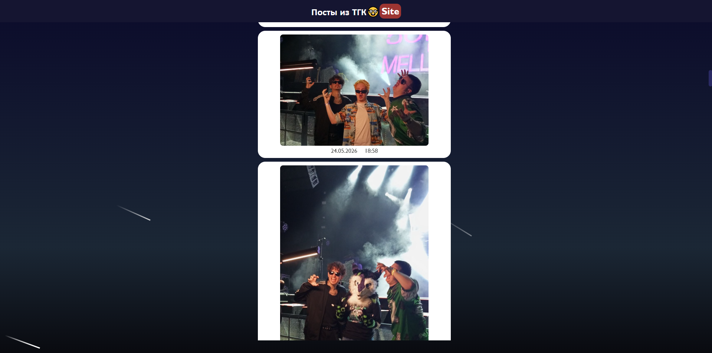
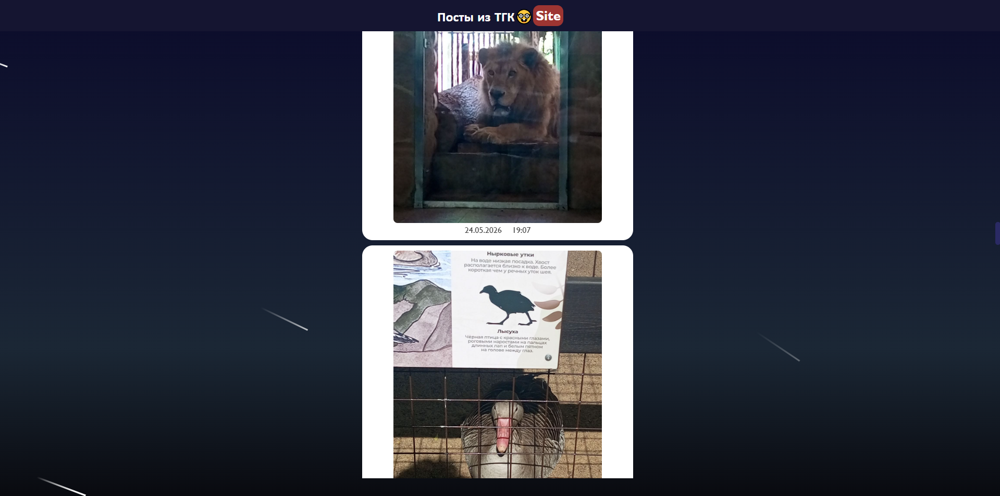
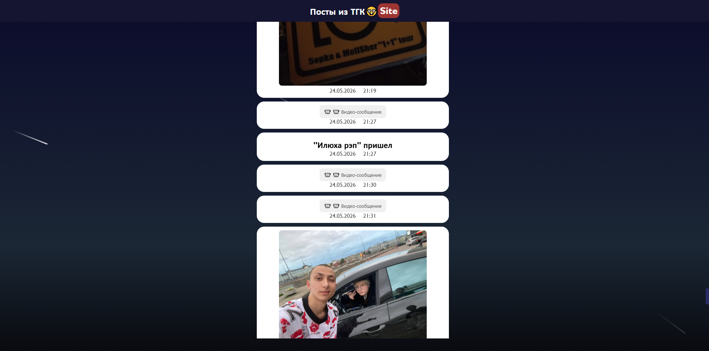

# Сервис по отображению сообщений из открытого ТГК на сайте

Сервис берет сообщения от и до определенного ID, пересылает их через бота (да, пока-что так. В будущем планирую это без костылей сделать) и показывает их на сайте в виде прикольной ленты

## Скриншоты



---

# Как запустить?
Загружаете исходники и настраиваете под себя

1. Создаем бота в ТГ через [@BotFather](https://t.me/BotFather)
2. Добавляем вашего бота в ваш ТГК (ну или ТГК, откуда вы хотите брать посты) с правами админа
3. Получаем API ключ и создаем .env файл.
    
    вставляем в него данные из [примера файла](./.env_example.txt) в строку `TG_BOT_KEY = `. На самом деле можно просто переименовать его в ".env"
4. Получаем и вставляем в тот-же файл ID нашего пользователя в строку `USER_ID = `
    
    узнать его можно в любом боте по типу ([@re_GetMyIDBot](https://t.me/re_GetMyIDBot))
5.  Указываем в `TG_CHANNEL = @` тег нашего канала (например `TG_CHANNEL = @zabadooj_cuts`)

6. В [файле конфигурации фронтенда](./frontend/src/_config.js) задаете диапозон от какого и до какого сообщения вам нужно получить

7. Устанавливаем зависимости для бэка
```
cd ./bacend/bot
```

```
pip install requirements.txt  
```

7. Запускаем наш локальный сервер (бэк)
```
uvicorn tg_bot:app --reload
```

8. Во втором терминале устанавливаем зависимости для фронта
```
cd frontend
```

```
npm i
```

9. Запускаем фронтенд
```
npm start
```

---

В будущем планирую допилить это до +- нормального результата, чтоб этим было удобно пользоваться и развертывать 🤓
